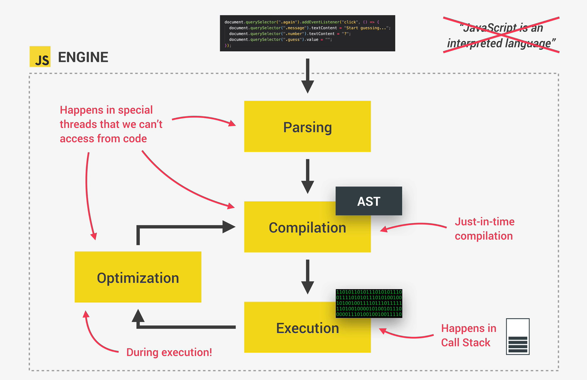
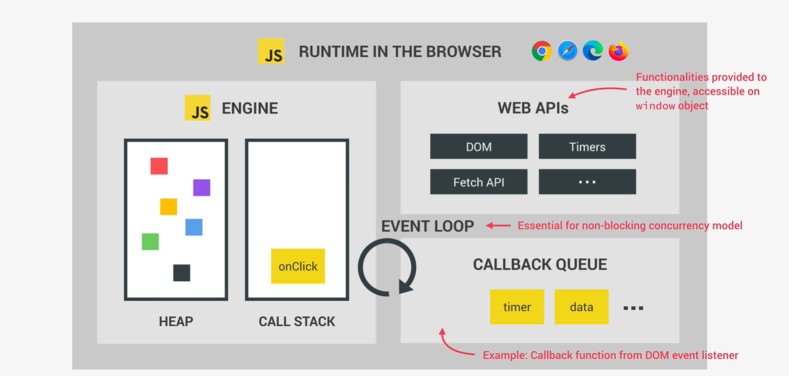

# JavaScript Behind the Scenes

## High-level Overview of JavaScript

- **High-level** language.
- **Garbage collector** - automatically removes old unused objects from the computer memory.
- **Interpreted** or **Just-in-time compiled** language - compiles the code to machine code.
- Multi-paradigm language. Procedural programming, **OOP programming**, **Functional programming**.
- Proto-type-based object-oriented language. Almost everything is an object in JavaScript.
- **First-class functions** - Functions are treated like any other variables. We can pass them to other functions as arguments or return them from other functions.
- **Dynamic typing** - We don't have to declare the type of a variable. Instead, they will be known only when JS engine executes our code.
- **Single-threaded**.
- **Non-blocking** event loop.

## JavaScript Engine and Runtime

Any JavaScript engine includes **Call Stack** and **Heap**.

Call stack is where our code is actually executed using Execution context.

Memory Heap is an unstructured memory pool where all the objects are stored that our application needs.

### Different between Interpretation and Compilation

**Compilation** - entire source code is converted to machine code at once.
First the machine code is built (Portable file), then it is executed in the CPU. 
Execution could happen way after code compilation.

Two steps:
* Source code -> (Compilation) -> Portable file -> (Execution) -> Program running

**Interpretation** - Interpreter runs through the source code and executes each line one by one.

One step (_code still needs to be converted into machine code_):
* Source code -> (Execution line by line) -> Program running

Compiled languages are much faster than Interpreted languages.

Modern JavaScript is using **mix** between interpretation and compilation - it is called **JIT (Just-in-time compilation)**.

**JIT** - Entire code is converted into machine code at once, then executed immediately (**NO PORTABLE FILE**).

Two steps:
* Source code -> (Compilation) -> Machine code -> (Execution) -> Program running

#### Runtime in the browser

(Imagine it as) Container including all the things that we need to use JavaScript in the browser. The heart of any JS Runtime is **JavaScript Engine**.

JavaScript Engine includes:

- **WEB APIs** - Are functionalities provided to the Engine (accessible on window object), but they are not part of the JavaScript itself.    
  - **Callback Queue** - Contains all the callback function ready to be executed.
- **Event Loop** - Takes callback functions from the Callback Queue and executes them.

### Title

