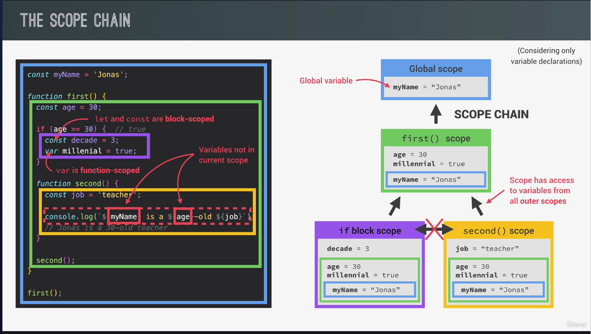
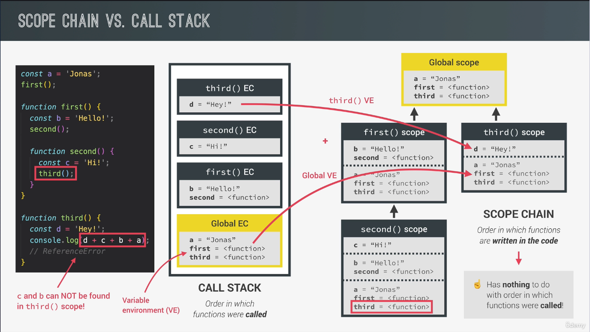

# JavaScript Behind the Scenes

## High-level Overview of JavaScript

- **High-level** language.
- **Garbage collector** - automatically removes old unused objects from the computer memory.
- **Interpreted** or **Just-in-time compiled** language - compiles the code to machine code.
- Multi-paradigm language. Procedural programming, **OOP programming**, **Functional programming**.
- Proto-type-based object-oriented language. Almost everything is an object in JavaScript.
- **First-class functions** - Functions are treated like any other variables. We can pass them to other functions as arguments or return them from other functions.
- **Dynamic typing** - We don't have to declare the type of a variable. Instead, they will be known only when JavaScript engine executes our code.
- **Single-threaded** - No multitasking.
- **Non-blocking** event loop.

## JavaScript Engine and Runtime

Any JavaScript engine includes **Call Stack** and **Heap**.

Call stack is where our code is actually executed using Execution context.

Memory Heap is an unstructured memory pool where all the objects are stored that our application needs.

### Different between Interpretation and Compilation

**Compilation** - entire source code is converted to machine code at once.
First the machine code is built (Portable file), then it is executed in the CPU. 
Execution could happen way after code compilation.

Two steps:
* Source code → (Compilation) → Portable file → (Execution) → Program running

**Interpretation** - Interpreter runs through the source code and executes each line one by one.

One step (_code still needs to be converted into machine code_):
* Source code → (Execution line by line) → Program running

Compiled languages are much faster than Interpreted languages.

Modern JavaScript is using **mix** between interpretation and compilation - it is called **JIT (Just-in-time compilation)**.

**JIT** - Entire code is converted into machine code at once, then executed immediately (**NO PORTABLE FILE**).

Two steps:
* Source code → (Compilation) → Machine code → (Execution) → Program running


#### Runtime in the browser

(Imagine it as) Container including all the things that we need to use JavaScript in the browser. The heart of any JS Runtime is **JavaScript Engine**.

JavaScript Engine includes:

- **WEB APIs** - Are functionalities provided to the Engine (accessible on window object), but they are not part of the JavaScript itself.    
  - **Callback Queue** - Contains all the callback function ready to be executed.
- **Event Loop** - Takes callback functions from the Callback Queue and executes them.


### Execution Context

The first thing that happens after our code is compiled, is creation of **global execution context** (for top-level code).

Execution context is an environment where piece of JavaScript code is executed. It stores all the necessary information needed for some code to be executed (variables, or argument passed to the function, etc...).

There is **always** only **ONE** global execution context. Each function gets its **own execution context** as soon as function got called.

#### Each Execution context has:
1. Variable Environment:
   - `let`, `const` and `var` declaration;
   - Function;
   - `arguments` object.
2. Scope Chain;
3. `this` keyword;

These are generated during "creation phase", right before execution. `this` keyword and `arguments` object do **NOT** belong to the arrow functions.

**Creation phase** and **Execution phase**. Core runs in the code stack.
Closing a browser window, this way we are closing the execution context as well.

### Scope and Scope Chaining

Scoping: How our program's variables are **organized** and **accessed**.
Scope asks questions: _Where do variables live?_ or _Where can we access a certain variable, and where not?_

#### Lexical Scoping

Scoping is controlled by **placement** of functions and blocks in the code.

**Scope**: Space or environment in which a certain variable is **declared** (_variable environment in case of functions_). There is **global** scope, **function** scope and **block** scope.

**Scope of variable**: Is entire region of our code, in which a certain variable can be **accessed**.


#### Variable Lookup

Scopes look up in the scope chain for the variable until they find the variable they need and simply use it. One scope can only look **UP** but not **DOWN**!

`let` and `const` are **block-scoped**. `var` is **function-scope**.




Scope is **a one-way** street!

### Hoisting in JavaScript

**Hoisting** makes some types of variables accessible/usable in the code before they are declared.

Behind the scenes, **Before execution** code is scanned for variable declarations, and for each variable, a new property is created in the **variable environment object**.

**Function declarations**: We **CAN** use function declarations before they are actually declared in the code. Block-scoped.

**`var` variables**: If we try to use variables declared using `var` before they are declared, we get `undefined` error. This is why we almost never use `var` variables. Function-scoped.

**`let` and `const` variables**: They are not hoisted (error: `uninitialized variable`). Placed in _temporal dead zone_. Block-scoped

**function expressions and arrow functions**: If created using `var` it is hoisted to `undefined`,but if created using `let` or `const`, it is not usable before they are declared in the code (TDZ).

**Temporal Dead Zone** is a special region of memory where we can't access any variables. Starts from where variable is called (where we try to use it before its declaration) and ends where we actually declared that variable in the code.

Variables declared with `var` will create properties in global `window` object.

### The `this`-keyword

It Is basically a special variable that is created for every execution context and therefore every function. It points to the owner of the function.

`this` is **NOT** static. Depends on **how** the function is called, and its value is only assigned when the function **is actually called**.

- **Method**: `this` points to Object that calls the method;

- **Simple function call**: `this` points to `undefined` (in case that `"strict mode"` is off, then it points to global `window` object in browser);
- **Arrow functions**: `this` points to the surrounding function (lexical `this`). Arrow functions don't get own `this`;
- **Event listener**: `this` will always point to the DOM element that handler is attached to.

### Memory Management

Is how the JavaScript engine allocates space in memory to create variables (and objects) and how it frees up the space, which is taken by these variables and objects when they are not needed anymore.

**How** and **where** are variables created in JavaScript. **Memory is automatically managed** by the JavaScript behind the scenes.


#### Allocate memory
👉🏻 Whenever we assign the value to a new variable, the JavaScript engine automatically allocate (_reserve_) a **piece of memory to store the value**.

`let num = 23.4`

#### Use memory

👉🏻 While code is running, **the value is written, read and updated** in the allocated piece of memory.
```js
num += 4;
calc(num);
```

#### Release memory

👉🏻 When no longer needed, **the value is deleted from memory** to free up resources. The released memory is used for new variables.
`num is removed from memory`

**Primitives** (also the references to objects) are allocated in the **CALL STACK**

**Objects** are allocated in the **Memory Heap**.

The variables (`location`) in the Call Stack DON'T hold objects but the **references (memory address) pointing to the objects values in the Memory Heap**.
```js
const location = {
    city: "Novi Sad",
    zipCode: "21000"
};
```

### Object References
#### Shallow vs Deep copy

**SHALLOW COPY**
```js
const personOne = {
    firstName: "Nemanja",
    lastName: "Karaklajic",
    birthYear: 1990
};

const personTwo = {...personOne};
personTwo.firstName = "Irina"

// 🚫 personTwo = { x: 20 }; // not allowed if personTwo is defined using const!

console.log(); // { firstName: "Nemanja", lastName: "Karaklajic", birthYear: 1990 };
console.log(); // { firstName: "Irina", lastName: "Karaklajic", birthYear: 1990 };
```

Using spread operator `...` we are creating a completely **NEW** object.


**DEEP COPY** - for nested objects/arrays

```js
const personOne = {
    firstName: "Nemanja",
    lastName: "Karaklajic",
    birthYear: 1990
};

const personClone = structuredClone(personOne);
personClone.firstName = "Jelena";

console.log("After: ", personClone);
console.log("Before: ", personOne);
```
### Garbage Collection

Variable environment is **simply deleted when Execution Context pops off stack**.

It is the **engine** that runes garbage collection automatically.

**Mark-And-Sweep** algorithm.

**Memory Leak**: When objects that are no longer needed are **incorrectly still reachable**, and therefore **not garbage collected**. Good examples are: Event listeners, timers, etc...

### Regular vs. Arrow Functions

`this`-keyword.

```js
const person = {
    firstName: "Nemanja",
    lastName: "Karaklajic",
    birthYear: 1990,
    calcAge: function () {
        const res = 2025 - this.birthYear
        console.log(res); // 35
        
        const logThis = () => {
            console.log(this); // Arrow functions don't have their `this`-keyword, so it looks up to the parent which is calcAge. calcAge has its `this` -> person;
        };
        
        logThis();
    }
};

// The (problem) example with arrow function:
const person = {
    firstName: "Nemanja",
    lastName: "Karaklajic",
    birthYear: 1990,
    calcAge: () => {
        const res = 2025 - this.birthYear
        console.log(this); // Window {...}
        console.log(res); // Error: NaN; window.birthYear - undefined 
        
        const isThisCorrect = function () {
            console.log(`isThisCorrect logging: ${this.firstName}`);
        };
        
        isThisCorrect();
    }
    
};
```

**You should never us an arrow function as a method (inside an object). Instead, use regular (declared) function.**